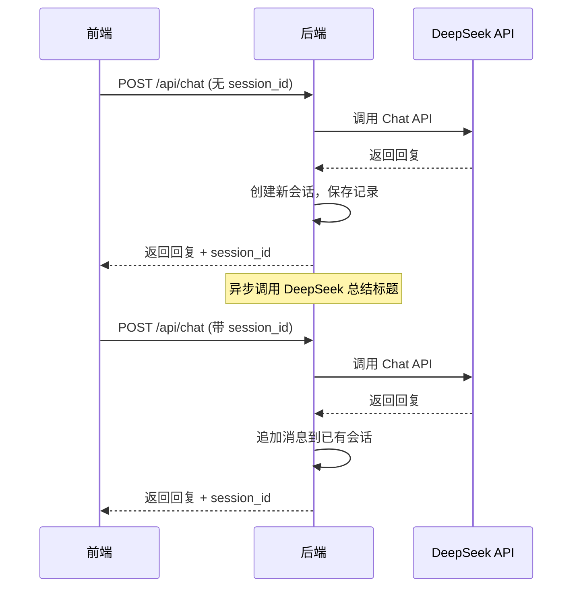

# Chat 会话记录 API 文档

## 概述

在原有 `/api/chat` 接口基础上增加了**会话记录保存**功能，并新增 3 个会话管理接口。

- 会话记录以 JSON 文件形式保存在 `data/chat_history/` 目录
- 每个会话一个文件（`{session_id}.json`），同时维护一个索引 `sessions.json`
- 新建会话后异步调用大模型总结 5-10 字标题

---

## 1. POST `/api/chat` （已增强）

### 请求体

```json
{
  "message": "你好，请介绍一下 Rust",
  "history": [],
  "model": "deepseek-chat",
  "thinking": null,
  "session_id": null
}
```

| 字段 | 类型 | 必填 | 说明 |
|------|------|------|------|
| `message` | string | ✅ | 用户输入的消息 |
| `history` | `ChatMessage[]` | ❌ | 历史对话记录 |
| `model` | string | ❌ | 模型名，默认 `deepseek-chat` |
| `thinking` | bool/null | ❌ | 是否开启思考模式 |
| `session_id` | string/null | ❌ | 会话 ID。**不传或为 null 时自动创建新会话**；传入已有 ID 则追加到现有会话 |

### 响应体

```json
{
  "success": true,
  "reply": "Rust 是一门...",
  "reasoning_content": null,
  "usage": {
    "prompt_tokens": 10,
    "completion_tokens": 50,
    "total_tokens": 60
  },
  "session_id": "a1b2c3d4-e5f6-7890-abcd-ef1234567890"
}
```

> [!IMPORTANT]
> 响应中新增了 `session_id` 字段，前端应保存此值并在后续对话中传回。

---

## 2. GET `/api/chat/sessions` — 获取会话列表

### 请求
无参数。

### 响应

```json
{
  "success": true,
  "sessions": [
    {
      "session_id": "a1b2c3d4-...",
      "title": "Rust语言介绍",
      "model": "deepseek-chat",
      "message_count": 4,
      "created_at": "2026-03-20 14:20:00",
      "updated_at": "2026-03-20 14:25:00"
    }
  ]
}
```

| 字段 | 说明 |
|------|------|
| `session_id` | 会话唯一 ID |
| `title` | 大模型总结的 5-10 字标题 |
| `model` | 使用的模型 |
| `message_count` | 消息总数（用户+助手） |
| `created_at` | 创建时间 |
| `updated_at` | 最后更新时间 |

---

## 3. POST `/api/chat/session` — 获取会话详情

### 请求体

```json
{
  "session_id": "a1b2c3d4-e5f6-7890-abcd-ef1234567890"
}
```

### 响应

```json
{
  "success": true,
  "session": {
    "session_id": "a1b2c3d4-...",
    "title": "Rust语言介绍",
    "model": "deepseek-chat",
    "messages": [
      { "role": "user", "content": "你好" },
      { "role": "assistant", "content": "你好！有什么..." }
    ],
    "created_at": "2026-03-20 14:20:00",
    "updated_at": "2026-03-20 14:25:00"
  }
}
```

---

## 4. POST `/api/chat/session/delete` — 删除会话

### 请求体

```json
{
  "session_id": "a1b2c3d4-e5f6-7890-abcd-ef1234567890"
}
```

### 响应

```json
{
  "success": true,
  "message": "会话 a1b2c3d4-... 已删除"
}
```

---

## 工作流程



## 存储结构

```
data/chat_history/
├── sessions.json                              # 会话索引
├── a1b2c3d4-e5f6-7890-abcd-ef1234567890.json  # 会话记录
└── ...
```
